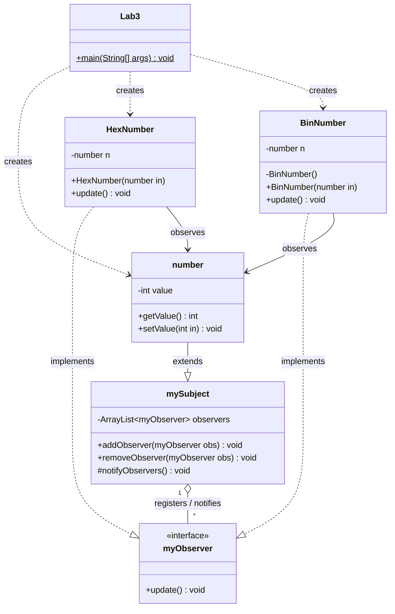
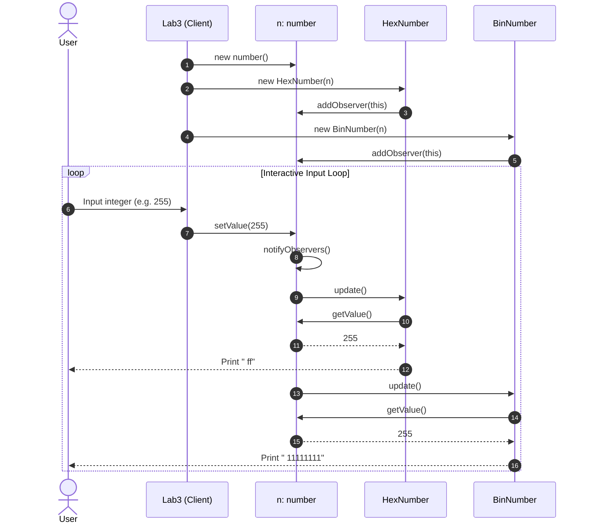

# CS324 Lab 3: Observer Design Pattern in Java

A clean, object-oriented implementation of the **Observer Design Pattern** (Gang of Four Behavioral Pattern) in Java, developed as part of the CS324 course at The University of the South Pacific.

---

## Table of Contents

- [Overview](#overview)
- [Design Pattern Architecture](#design-pattern-architecture)
  - [Roles and Responsibilities](#roles-and-responsibilities)
  - [UML Class Diagram](#uml-class-diagram)
  - [Interaction Sequence Diagram](#interaction-sequence-diagram)
- [Project Directory Structure](#project-directory-structure)
- [Source Code Walkthrough](#source-code-walkthrough)
  - [`myObserver.java`](#myobserverjava)
  - [`mySubject.java`](#mysubjectjava)
  - [`number.java`](#numberjava)
  - [`HexNumber.java`](#hexnumberjava)
  - [`BinNumber.java`](#binnumberjava)
  - [`Lab3.java`](#lab3java)
- [How It Works (Runtime Flow)](#how-it-works-runtime-flow)
- [Building and Running](#building-and-running)
  - [Prerequisites](#prerequisites)
  - [Option 1: Using Command Line (`javac` / `java`)](#option-1-using-command-line-javac--java)
  - [Option 2: Using Apache Ant](#option-2-using-apache-ant)
  - [Option 3: Using NetBeans / Modern IDEs](#option-3-using-netbeans--modern-ides)
- [Example Output](#example-output)
- [Design Considerations & Enhancements](#design-considerations--enhancements)

---

## Overview

The **Observer Pattern** defines a one-to-many dependency between objects so that when one object (the **Subject**) changes its state, all its dependents (the **Observers**) are notified and updated automatically.

In this project:
- The **Subject** holds an integer value entered by the user.
- Multiple **Observers** (`HexNumber` and `BinNumber`) subscribe to this subject.
- Whenever the user inputs a new integer, the subject updates its value and notifies all registered observers.
- Each observer automatically calculates and prints its formatted representation:
  - `HexNumber` outputs the hexadecimal equivalent.
  - `BinNumber` outputs the binary equivalent.

---

## Design Pattern Architecture

### Roles and Responsibilities

| Component | Role in Observer Pattern | Description |
| :--- | :--- | :--- |
| [`myObserver`](file:///c:/Users/ronil_47xp2lm/OneDrive%20-%20The%20University%20of%20the%20South%20Pacific/Resources/Semester%206/CS324/Week%204/Lab%20resources/Lab3/src/lab3/myObserver.java) | **Observer Interface** | Declares the `update()` contract for objects that should be notified of changes in a subject. |
| [`mySubject`](file:///c:/Users/ronil_47xp2lm/OneDrive%20-%20The%20University%20of%20the%20South%20Pacific/Resources/Semester%206/CS324/Week%204/Lab%20resources/Lab3/src/lab3/mySubject.java) | **Subject (Observable)** | Manages observers with an internal collection (`ArrayList<myObserver>`), providing `addObserver`, `removeObserver`, and `notifyObservers`. |
| [`number`](file:///c:/Users/ronil_47xp2lm/OneDrive%20-%20The%20University%20of%20the%20South%20Pacific/Resources/Semester%206/CS324/Week%204/Lab%20resources/Lab3/src/lab3/number.java) | **Concrete Subject** | Extends `mySubject`. Stores the state (`int value`). When `setValue()` is called, it triggers `notifyObservers()`. |
| [`HexNumber`](file:///c:/Users/ronil_47xp2lm/OneDrive%20-%20The%20University%20of%20the%20South%20Pacific/Resources/Semester%206/CS324/Week%204/Lab%20resources/Lab3/src/lab3/HexNumber.java) | **Concrete Observer** | Implements `myObserver`. Subscribes to `number` and prints the hexadecimal representation on `update()`. |
| [`BinNumber`](file:///c:/Users/ronil_47xp2lm/OneDrive%20-%20The%20University%20of%20the%20South%20Pacific/Resources/Semester%206/CS324/Week%204/Lab%20resources/Lab3/src/lab3/BinNumber.java) | **Concrete Observer** | Implements `myObserver`. Subscribes to `number` and prints the binary representation on `update()`. |
| [`Lab3`](file:///c:/Users/ronil_47xp2lm/OneDrive%20-%20The%20University%20of%20the%20South%20Pacific/Resources/Semester%206/CS324/Week%204/Lab%20resources/Lab3/src/lab3/Lab3.java) | **Client / Driver** | Entry point containing `main()`. Instantiates the subject and observers, then runs a console input loop. |

---

### UML Class Diagram



---

### Interaction Sequence Diagram



---

## Project Directory Structure

```text
Lab3/
├── build.xml               # Apache Ant build configuration
├── manifest.mf             # JAR manifest file
├── nbproject/              # NetBeans IDE project metadata and configurations
│   ├── build-impl.xml
│   ├── genfiles.properties
│   ├── project.properties
│   └── project.xml
├── src/                    # Source code directory
│   └── lab3/               # Package: lab3
│       ├── BinNumber.java  # Concrete Observer (Binary conversion)
│       ├── HexNumber.java  # Concrete Observer (Hexadecimal conversion)
│       ├── Lab3.java       # Driver class with main() entry point
│       ├── myObserver.java # Observer interface contract
│       ├── mySubject.java  # Subject base class with observer registry
│       └── number.java     # Concrete Subject encapsulating integer state
└── test/                   # Test suite directory (reserved for unit tests)
```

---

## Source Code Walkthrough

### [`myObserver.java`](file:///c:/Users/ronil_47xp2lm/OneDrive%20-%20The%20University%20of%20the%20South%20Pacific/Resources/Semester%206/CS324/Week%204/Lab%20resources/Lab3/src/lab3/myObserver.java)
Defines the uniform interface for all observer implementations:
```java
package lab3;

public interface myObserver {
    public void update(); 
}
```
Any object that needs to be notified of state changes in a subject implements this interface and provides concrete logic inside `update()`.

---

### [`mySubject.java`](file:///c:/Users/ronil_47xp2lm/OneDrive%20-%20The%20University%20of%20the%20South%20Pacific/Resources/Semester%206/CS324/Week%204/Lab%20resources/Lab3/src/lab3/mySubject.java)
Provides the registration and dispatching mechanisms:
- `observers`: Internal `ArrayList<myObserver>` holding references to registered listeners.
- `addObserver(myObserver obs)`: Registers a new observer.
- `removeObserver(myObserver obs)`: Deregisters an observer.
- `notifyObservers()`: Iterates through all registered observers and invokes `update()` on each.

---

### [`number.java`](file:///c:/Users/ronil_47xp2lm/OneDrive%20-%20The%20University%20of%20the%20South%20Pacific/Resources/Semester%206/CS324/Week%204/Lab%20resources/Lab3/src/lab3/number.java)
The concrete subject extending `mySubject`:
- Encapsulates private state: `private int value`.
- `getValue()`: Accessor for observers to pull the updated value.
- `setValue(int in)`: Mutator that updates `value` and immediately calls `notifyObservers()`.

---

### [`HexNumber.java`](file:///c:/Users/ronil_47xp2lm/OneDrive%20-%20The%20University%20of%20the%20South%20Pacific/Resources/Semester%206/CS324/Week%204/Lab%20resources/Lab3/src/lab3/HexNumber.java)
Observes the `number` subject:
- In its constructor, it accepts the `number` subject instance and self-registers:
  ```java
  public HexNumber( number in ) {
      this.n = in;
      n.addObserver( this );
  }
  ```
- In `update()`, it queries `n.getValue()` and prints `Integer.toHexString(n.getValue())`.

---

### [`BinNumber.java`](file:///c:/Users/ronil_47xp2lm/OneDrive%20-%20The%20University%20of%20the%20South%20Pacific/Resources/Semester%206/CS324/Week%204/Lab%20resources/Lab3/src/lab3/BinNumber.java)
Observes the `number` subject:
- In its constructor, it accepts the `number` subject instance and self-registers:
  ```java
  public BinNumber( number in ) {
      this.n = in;
      n.addObserver( this );
  }
  ```
- In `update()`, it queries `n.getValue()` and prints `Integer.toBinaryString(n.getValue())`.

---

### [`Lab3.java`](file:///c:/Users/ronil_47xp2lm/OneDrive%20-%20The%20University%20of%20the%20South%20Pacific/Resources/Semester%206/CS324/Week%204/Lab%20resources/Lab3/src/lab3/Lab3.java)
The program driver:
1. Creates an instance of `number`.
2. Attaches `HexNumber` and `BinNumber` instances to `number`.
3. Enters an infinite `while (true)` loop prompting the user for an integer via `Scanner.nextInt()`.
4. Passing the entered value into `n.setValue(...)` automatically triggers the output from both observers.

---

## How It Works (Runtime Flow)

1. **Pull Model Implementation**:
   Notice that the `update()` method accepts no arguments. Instead of the subject pushing data directly inside `notifyObservers()`, observers maintain a reference to the subject and "pull" the state using `n.getValue()`. This keeps the `myObserver` interface generic and reusable.
2. **Dynamic Subscription**:
   Because `addObserver` and `removeObserver` operate on the `myObserver` interface, new observers (e.g. `OctalNumber`) can be introduced at any time without modifying `mySubject` or `number` (adhering to the **Open/Closed Principle**).

---

## Building and Running

### Prerequisites
- **Java Development Kit (JDK)**: JDK 7 or higher (compatible with JDK 8, 11, 17, 21+).
- *(Optional)* **Apache Ant** (if building via Ant).

---

### Option 1: Using Command Line (`javac` / `java`)

From the root project directory:

1. **Compile all Java source files**:
   ```bash
   javac -d build/classes src/lab3/*.java
   ```

2. **Run the program**:
   ```bash
   java -cp build/classes lab3.Lab3
   ```

---

### Option 2: Using Apache Ant

This project contains standard NetBeans Ant build files:

1. **Clean and compile**:
   ```bash
   ant compile
   ```

2. **Run the application**:
   ```bash
   ant run
   ```

3. **Package as a standalone JAR**:
   ```bash
   ant jar
   ```
   The generated JAR will be located at `dist/Lab3.jar` and can be executed via:
   ```bash
   java -jar dist/Lab3.jar
   ```

---

### Option 3: Using NetBeans / Modern IDEs

- **NetBeans**:
  1. Click **File > Open Project** and select this directory (`Lab3`).
  2. Press **F6** or click **Run Project**.
- **IntelliJ IDEA / Eclipse / VS Code**:
  1. Open the project folder.
  2. Mark `src` as the Source Root.
  3. Locate [`Lab3.java`](file:///c:/Users/ronil_47xp2lm/OneDrive%20-%20The%20University%20of%20the%20South%20Pacific/Resources/Semester%206/CS324/Week%204/Lab%20resources/Lab3/src/lab3/Lab3.java) and click **Run**.

---

## Example Output

When running `Lab3`, the console provides an interactive prompt:

```text
Enter a number: 10
 a 1010
Enter a number: 16
 10 10000
Enter a number: 255
 ff 11111111
Enter a number: 1024
 400 10000000000
Enter a number: 
```

> **Note**: In each line of output, the first value is produced by `HexNumber` and the second value is produced by `BinNumber` in the order they were registered.

---

## Design Considerations & Enhancements

For production environments or academic extensions, consider the following enhancements:

1. **Java Naming Conventions**:
   - Class names traditionally follow `PascalCase` (`MySubject`, `MyObserver`, `Number`).
   - Notice that naming the class `number` shadows `java.lang.Number` — renaming it to `NumberSubject` or `ObservableValue` avoids namespace ambiguity.
2. **Loop Termination**:
   - The current console loop `while (true)` runs indefinitely until interrupted (`Ctrl + C`). Adding a sentinel value (e.g. entering `-1` or `exit`) allows clean termination and resource closing for `Scanner`.
3. **Push vs. Pull Model**:
   - The current implementation uses the **Pull Model** (`update()` pulls via `n.getValue()`).
   - Alternatively, the **Push Model** could pass the new value as a parameter: `update(int newValue)`, which further decouples the observer from the concrete subject instance.
4. **Thread Safety**:
   - If modified concurrently across multiple threads, `observers` should use `CopyOnWriteArrayList` or synchronized access to avoid `ConcurrentModificationException`.
