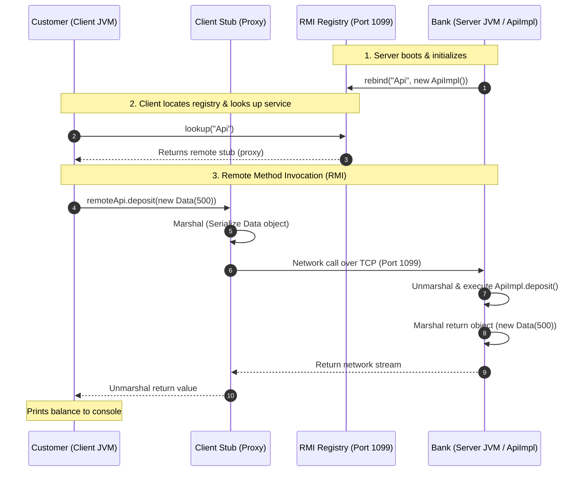

# CS324 Distributed Systems — Lab 5: Java Remote Method Invocation (RMI)

A comprehensive implementation, experimental guide, and solutions manual for **Lab 5: Remote Method Invocation in Java**.

---

## 📌 Table of Contents
- [Overview](#overview)
- [System Architecture](#system-architecture)
- [Repository Structure](#repository-structure)
- [Key RMI Concepts](#key-rmi-concepts)
- [Lab Exercises Breakdown](#lab-exercises-breakdown)
  - [Exercise 1: Baseline Client-Server RMI](#exercise-1-baseline-client-server-rmi)
  - [Exercise 2: Extending Remote Operations](#exercise-2-extending-remote-operations)
  - [Exercise 3: Object Serialization with `Data`](#exercise-3-object-serialization-with-data)
- [Lab Questions & Verified Answers](#lab-questions--verified-answers)
- [Compilation & Execution Guide](#compilation--execution-guide)
  - [Using Windows Command Prompt (CMD)](#using-windows-command-prompt-cmd)
  - [Using Windows PowerShell](#using-windows-powershell)
  - [Using NetBeans IDE](#using-netbeans-ide)
- [Expected Output & Verification](#expected-output--verification)
- [Troubleshooting & Common Pitfalls](#troubleshooting--common-pitfalls)

---

## 📖 Overview

This project demonstrates **Java Remote Method Invocation (RMI)** for distributed systems programming. It comprises two separate applications:
1. **`Bank` (Server)**: Hosts the remote service implementation (`ApiImpl`), maintains the bank account state, creates an in-process RMI registry on port `1099`, and binds the remote object.
2. **`Customer` (Client)**: Connects to the RMI registry on `localhost:1099`, looks up the remote object stub, and invokes methods remotely as if they were local Java method calls.

---

## 🏗️ System Architecture



---

## 📂 Repository Structure

```text
Lab 5/
│
├── Bank/                               # Server Project
│   ├── src/
│   │   ├── api/
│   │   │   ├── Api.java               # Remote Interface (Contract)
│   │   │   └── Data.java              # Serializable Transfer Object
│   │   └── bank/
│   │       ├── ApiImpl.java           # Remote Object Implementation
│   │       └── Bank.java              # Server Main (Registry & Rebind)
│   └── build/classes/                 # Compiled Server Bytecode
│
├── Customer/                           # Client Project
│   ├── src/
│   │   ├── api/
│   │   │   ├── Api.java               # Identical Remote Interface
│   │   │   └── Data.java              # Identical Serializable Transfer Object
│   │   └── customer/
│   │       └── Customer.java          # Client Main (Lookup & Invocations)
│   └── build/classes/                 # Compiled Client Bytecode
│
├── Lab_5_Solutions.md                 # Detailed Lab Question Answers & Trace
└── README.md                          # Comprehensive Documentation
```

---

## 🔑 Key RMI Concepts

1. **Remote Interface (`java.rmi.Remote`)**:
   - Acts as the contract between client and server.
   - Every method callable across the network must declare `throws RemoteException`.
2. **Remote Object (`java.rmi.server.UnicastRemoteObject`)**:
   - The server-side class that exports the object so it can listen for incoming remote calls on an anonymous or designated port.
3. **RMI Registry (`LocateRegistry`)**:
   - A naming lookup service (default port `1099`).
   - The server registers instances using `registry.rebind("Name", remoteObject)`.
   - The client looks up references using `(Api) registry.lookup("Name")`.
4. **Marshaling & Serialization (`java.io.Serializable`)**:
   - Remote primitive arguments and custom object arguments are converted into byte streams (**marshaling**) to travel over TCP/IP sockets, and reconstructed on the other end (**unmarshaling**).
   - Custom objects transferred across boundaries **must** implement `Serializable`.

---

## 🛠️ Lab Exercises Breakdown

### Exercise 1: Baseline Client-Server RMI
- **Goal**: Compile, execute, and understand the core communication loop between `Bank` and `Customer`.
- **Key Method**: `setBalance(int value)` sets the account balance to a specified integer.

### Exercise 2: Extending Remote Operations
- **Goal**: Add realistic banking operations and observe server state persistence.
- **Methods Added**:
  1. `deposit(int amount)`: Adds money to the existing balance.
  2. `withdraw(int amount)`: Subtracts money from the balance.
  3. `addInterest(int rate)`: Calculates and adds interest based on a percentage rate.
- **Behavior Observed**: Running the client multiple times accumulates state on the server.

### Exercise 3: Object Serialization with `Data`
- **Goal**: Pass full Java objects as method arguments and return types.
- **Implementation**:
  - Created `Data.java` implementing `java.io.Serializable` with `serialVersionUID = 1L`.
  - Updated all method signatures in `Api.java` and `ApiImpl.java` to accept and return `Data`:
    ```java
    public Data setBalance(Data value) throws RemoteException;
    public Data deposit(Data amount) throws RemoteException;
    public Data withdraw(Data amount) throws RemoteException;
    public Data addInterest(Data rate) throws RemoteException;
    ```

---

## 📝 Lab Questions & Verified Answers

### Question 1: What does the file `Api.java` contain? Why do both projects contain a file `Api.java`?
- **Answer**: `Api.java` contains the **Remote Interface** extending `java.rmi.Remote`. It declares the methods exposed for remote invocation. Both projects require it because it serves as the shared contract:
  - **Server (`Bank`)**: Needs `Api.java` to implement the interface in `ApiImpl`.
  - **Client (`Customer`)**: Needs `Api.java` to type-cast the lookup proxy stub and know which methods can be called, without needing server implementation source code.

### Question 2: Why does only one of the projects contain a file `ApiImpl.java`?
- **Answer**: `ApiImpl.java` is the concrete implementation containing the server's business logic and mutable state. The client only needs the interface stub to invoke calls remotely; sharing the implementation code with the client would violate network abstraction, security, and the client-server paradigm.

### Question 3: Describe what happens when the client calls method `setBalance(1000)`?
- **Answer**:
  1. **Invocation**: Client calls `remoteApi.setBalance(...)` on the local stub proxy.
  2. **Marshaling**: Client RMI runtime serializes the method signature and argument into a byte stream.
  3. **Network Transport**: The stream is transmitted over TCP port 1099 to the server host.
  4. **Unmarshaling**: Server RMI runtime deserializes the argument and locates the `ApiImpl` target instance.
  5. **Execution**: `ApiImpl.setBalance()` runs on the server, modifying internal state (`account`).
  6. **Return Marshaling**: The return value is serialized and sent back across the socket.
  7. **Completion**: Client stub unmarshals the result and returns it to the client caller thread.

### Question 4: In which line does the server register its service, in which line does the client connect to the registry?
- **Answer**:
  - **Server Registration (`Bank.java`)**: Line **24** (`registry.rebind(Api.class.getSimpleName(), new ApiImpl());`).
  - **Client Connection (`Customer.java`)**: Line **18** (`registry = LocateRegistry.getRegistry(HOST, PORT);`).

### Question 5: Run the client several times. What is the output?
- **Answer**: Output is always `New balance = 1000`. Because `setBalance(1000)` unconditionally overwrites the balance with `1000`, the result is identical on every client run.

### Question 6: Open the task manager in Windows, and locate the process running the server. Why is the server running continuously?
- **Answer**: `LocateRegistry.createRegistry(1099)` and `UnicastRemoteObject` launch non-daemon background threads (TCP socket listeners) to wait for incoming connections. In Java, a JVM remains running as long as at least one non-daemon thread is alive.

### Question 7: Where is the process for the client?
- **Answer**: The client process terminates and disappears immediately after its `main()` method completes because it has no remaining non-daemon threads.

### Question 8: Run the client several times (Exercise 2). What is the output?
- **Answer**:
  - **Run 1**: Deposit 500 -> 500; Withdraw 200 -> 300; Add 10% Interest -> 330.0
  - **Run 2**: Deposit 500 -> 830; Withdraw 200 -> 630; Add 10% Interest -> 693.0
  - **Run 3**: Deposit 500 -> 1193; Withdraw 200 -> 993; Add 10% Interest -> 1092.3
  - **Explanation**: The server's `ApiImpl` instance remains in memory between client runs. Unlike `setBalance()`, operations like deposit and interest accumulate, proving that **state is preserved across multiple client runs**.

### Question 9: Build and restart the server. Run the client several times (Exercise 3). What is the output?
- **Answer**:
  ```text
  Deposit 500: New balance = 500
  Withdraw 200: New balance = 300
  Add 10% Interest: New balance = 330
  ```
  Subsequent runs continue accumulating (`830`, `630`, `693` on Run 2; `1193`, `993`, `1092` on Run 3).

### Question 10: `class Data implements Serializable`. What does it mean to serialize an object, and why is this necessary in the context of RMIs?
- **Answer**:
  - **Definition**: **Serialization** is converting an object's state into a linear sequence of bytes. **Deserialization** reconstructs an equivalent copy of the object in memory on the receiving side.
  - **Necessity in RMI**: Client and Server run in completely separate JVM processes with isolated memory spaces (often on different physical computers). Memory pointers cannot cross network boundaries. When non-remote objects are passed or returned, RMI transfers them **by value**. Without implementing `java.io.Serializable`, the JVM throws `java.io.NotSerializableException`.

---

## 💻 Compilation & Execution Guide

Ensure your terminal is in the project root directory:
```cmd
cd "c:\Users\ronil_47xp2lm\OneDrive - The University of the South Pacific\Resources\Semester 6\CS324\Week 6\Lab Resources\Lab 5"
```

### Using Windows Command Prompt (CMD)

#### Step 1: Compile both projects
```cmd
javac -d Bank/build/classes Bank\src\api\*.java Bank\src\bank\*.java
javac -d Customer/build/classes Customer\src\api\*.java Customer\src\customer\*.java
```

#### Step 2: Start the Bank Server (Terminal 1)
```cmd
java -cp Bank/build/classes bank.Bank
```
*Expected Output:* `system is ready`

#### Step 3: Run the Customer Client (Terminal 2)
```cmd
java -cp Customer/build/classes customer.Customer
```

---

### Using Windows PowerShell

#### Step 1: Compile both projects
```powershell
javac -d Bank/build/classes Bank/src/api/*.java Bank/src/bank/*.java
javac -d Customer/build/classes Customer/src/api/*.java Customer/src/customer/*.java
```

#### Step 2: Start the Bank Server (Terminal 1)
```powershell
java -cp Bank/build/classes bank.Bank
```

#### Step 3: Run the Customer Client (Terminal 2)
```powershell
java -cp Customer/build/classes customer.Customer
```

---

### Using NetBeans IDE
1. Open NetBeans (e.g. NetBeans 7.x / 8.x / 12+ / Apache NetBeans).
2. Open both projects: **`Bank`** and **`Customer`**.
3. Right-click **`Bank`** -> Select **Clean and Build**, then right-click `Bank.java` -> **Run File**.
4. Right-click **`Customer`** -> Select **Clean and Build**, then right-click `Customer.java` -> **Run File**.

---

## 📊 Expected Output & Verification

### Bank Server Console:
```text
system is ready
deposited: 500, new balance: 500
withdrawn: 200, new balance: 300
added interest rate 10%, new balance: 330
deposited: 500, new balance: 830
withdrawn: 200, new balance: 630
added interest rate 10%, new balance: 693
```

### Customer Client Console:
```text
Deposit 500: New balance = 500
Withdraw 200: New balance = 300
Add 10% Interest: New balance = 330
```

---

## ⚠️ Troubleshooting & Common Pitfalls

| Issue | Cause | Resolution |
| :--- | :--- | :--- |
| `'ForEach-Object' is not recognized` | Running a PowerShell pipeline inside CMD | Use CMD wildcard syntax: `javac -d Bank/build/classes Bank\src\api\*.java Bank\src\bank\*.java` |
| `java.rmi.server.ExportException: Port already in use: 1099` | A previous server instance is still running in the background | Find PID: `netstat -ano \| findstr 1099`<br>Kill process: `taskkill /F /PID <PID>` |
| `java.io.NotSerializableException: api.Data` | `Data.java` does not implement `Serializable` | Ensure `public class Data implements Serializable` with `serialVersionUID = 1L;` |
| `java.rmi.NotBoundException: Api` | Client looked up service before server completed `registry.rebind` | Ensure server is started and prints `system is ready` before starting client |
